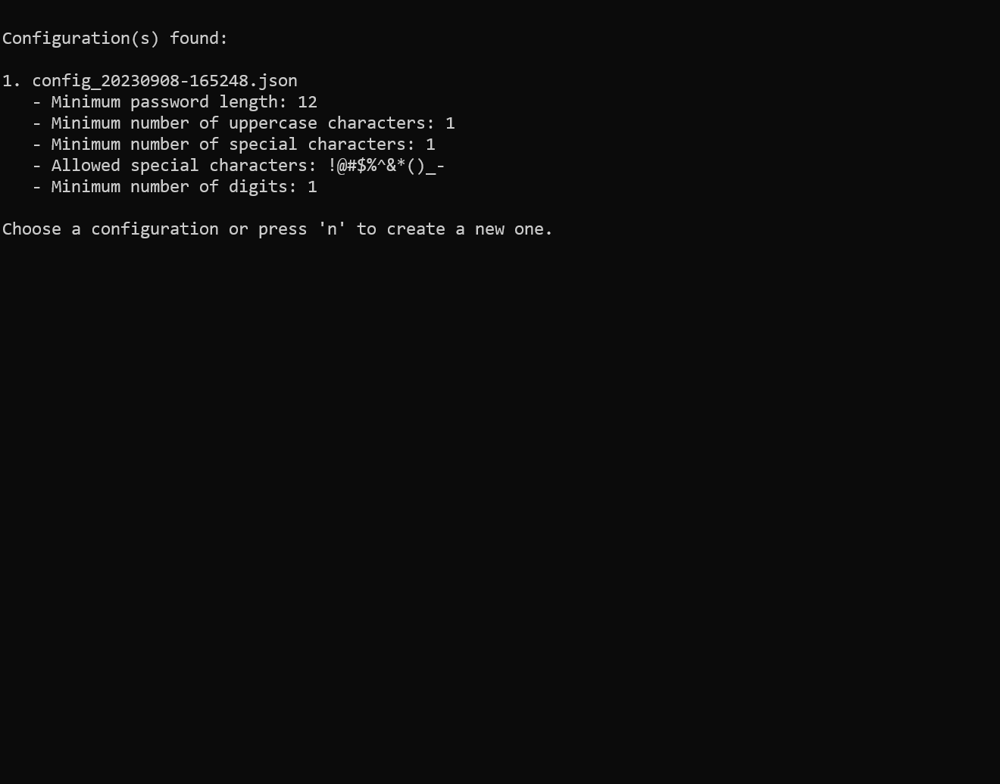

# Password Polisher

## Description

This project filters password dictionaries based on complexity criteria defined by the user. Once the security policy is set, the user can select a dictionary or merge several dictionaries, and the program will filter the passwords according to the chosen policy.

## Features

* Configuration: users can set a password complexity policy, which is saved in a JSON file.
* Dictionary Selection: uers can choose a specific dictionary or request the merging of all available dictionaries.
* Filtering: the program filters passwords based on the set policy.
* Results: at the end, the program displays statistics about the total number of passwords processed, the number of valid passwords retained, and the total processing time.

# How to Use

* Compilation: compile the program using the command go build.
* Execution: run the generated binary.
* Follow the on-screen instructions !
